# $250 Night Vision Build
Night vision is extremely expensive for a lot of people. There are DIY options like PVS420 and its related projects. This is a much simpler, dumber, and cheaper option. The skill required for this is entry-level; there are only two wires to solder.

## Bill of materials
| Item  | Price | Link |
| ------------- |:-------------:| ----- |
| PVS2 intensifier tube | $160     |  https://whatacountry.com/pvs-2-image-intensifier-tube.aspx |
| 25mm lens  | $27     |  https://www.amazon.com/dp/B0C7BJQZPV |
| Battery housing      | $7     | https://www.amazon.com/dp/B07W6SJGJM |
| Jeweler's loupe | $10 | https://www.amazon.com/dp/B07R7NLSMJ |
| Power toggle  | $5 | https://www.amazon.com/dp/B0FPFTY3TF |
| Lens adapter (pack of 2)  |$7  | https://www.amazon.com/dp/B09STVLLVY |
| Battery box | $6 | https://www.amazon.com/dp/B07T7MTRZX |
| **Total** | **$221** | |

### Other items needed

* Soldering iron
* Solder
* Hot glue gun
* Glue
* Duct tape
* 4x AA batteries

## Print settings
* Layer height: .12mm
* Walls: 6
* Infill: 75%
   * Test was printed at 100%, but that is definitely unnecessary

To ensure best fitment, the ocular and objective lenses should be printed at 104% of their current size.

## Assembly
### Ocular lens cap
Unscrew the jeweler's loupe and thread it through the hole in the ocular lens cap. Screw the top of the jeweler's loupe back down, sandwiching the plastic pieces between the metal loupe threads.

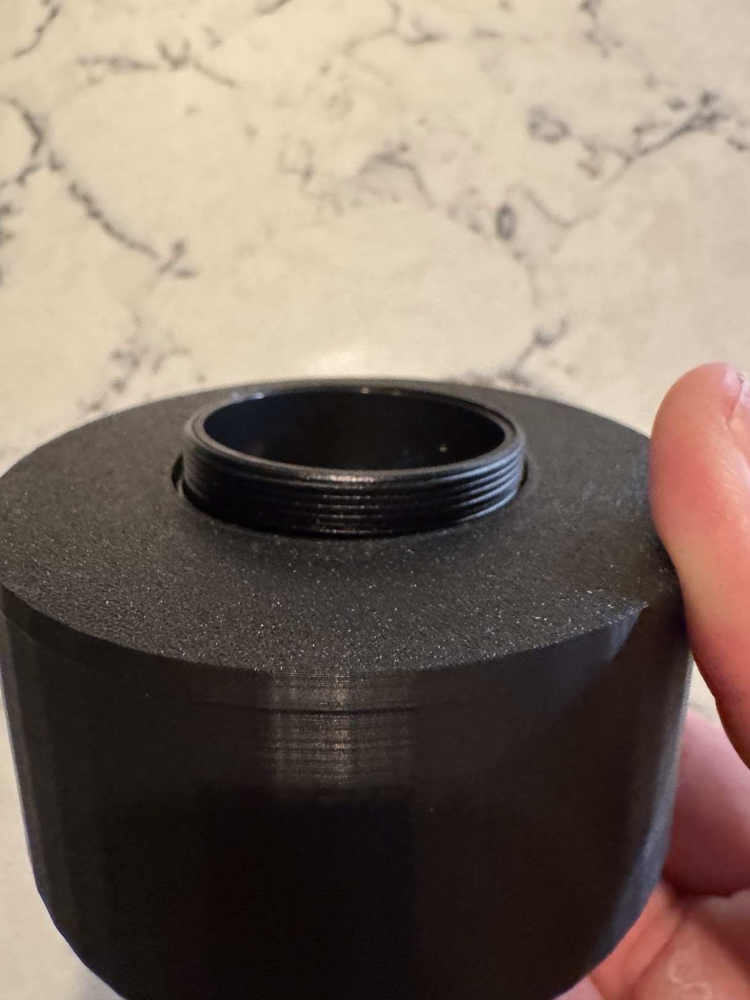

Glue is optional for additional securing. Don't glue in place until certain that the lens is lined up correctly for viewing the tube.

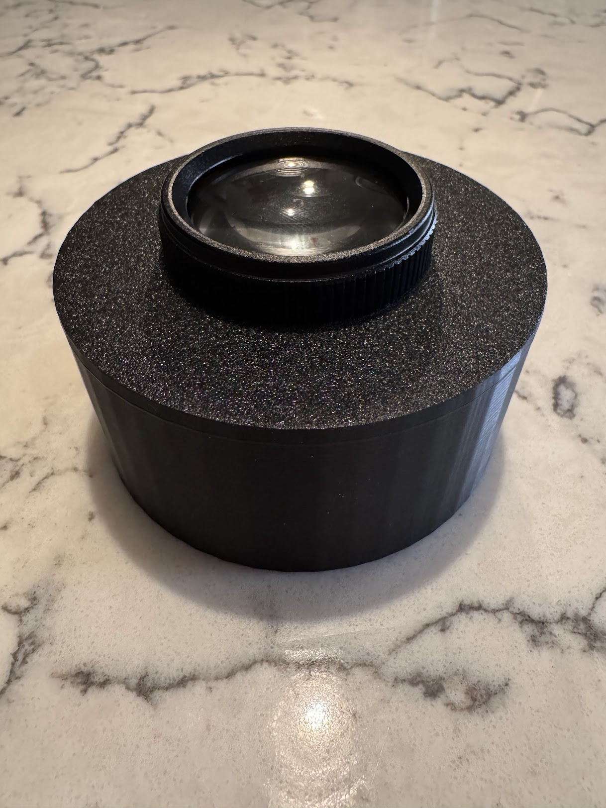

### Objective lens cap
Similar to the ocular lens, use the two C-mount adapters to sandwich the plastic objective lens cap between the two adapters. Then screw the 25mm lens to the outside mount adapter. Hand tighten to secure.

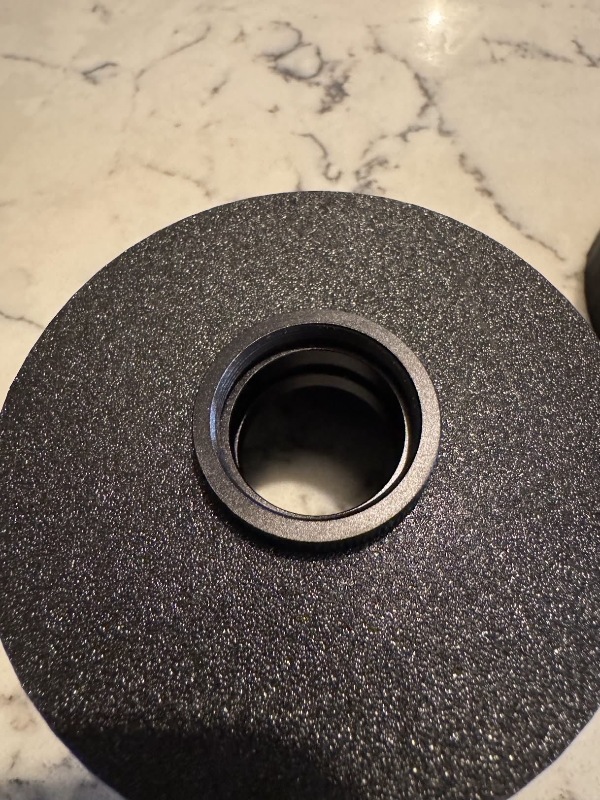

Again, glue is optional but should not be used until focal length is confirmed.

### PVS2 wiring
The PVS2 tube only needs a positive and a negative wire to power the tube. The negative wire is soldered to the metal ground surrounding the phosphor objective screen.

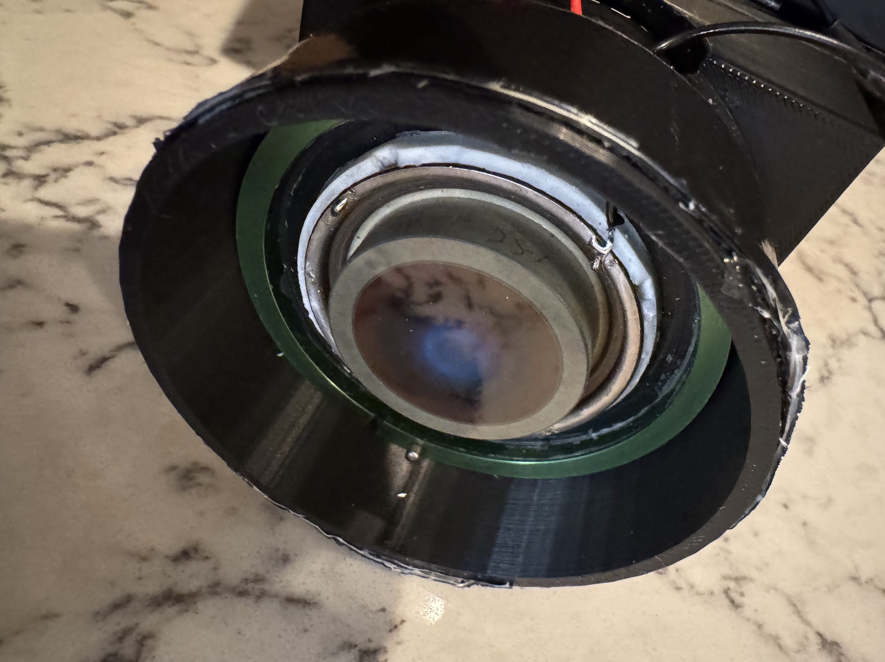

At this point, skip down to the "Fitting the tube" section to mount the tube into the housing. Once the tube is mounted, return here to continue soldering the power connections.

The positive wire is soldered into the terminal on the body of the tube. There are reports that a 2.5mm screw will fit into the terminal, but I was not able to confirm this.

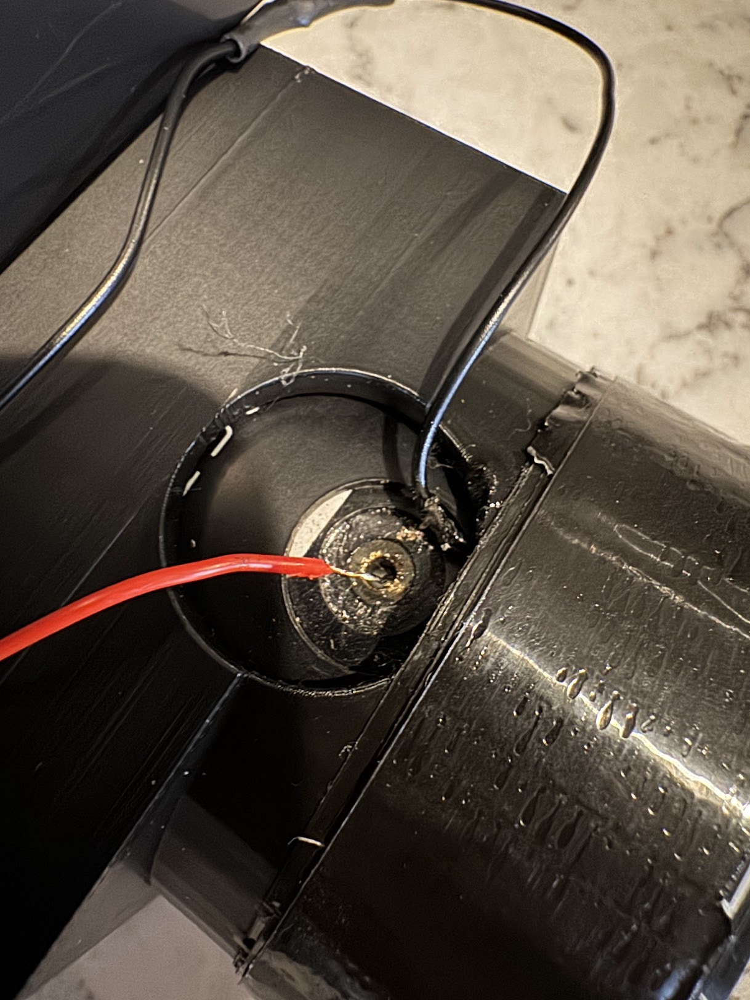

The negative wire can terminate into the battery box. The positive wire feeds to the power toggle and then the battery box. The power toggle is important as it keeps the unit powered off in normal lighting, protecting the tube.

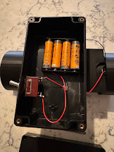

### Fitting the tube
With the negative lead secured to the ground, slide the tube into the housing, pulling the negative wire through the hole in the housing as it progresses. To ensure a more secure fit, wrap the PVS2 tube in a single layer of duct tape. This ought to provide enough resistance to prevent it from sliding around and rotating or shifting inside the housing.

After the tube is secured into the housing, it's much easier to finish wiring the positive terminal and powering the unit.

### Fitting objective/ocular lens caps
If the lens caps were printed at 104% of their size, there will be some play on each end of the lens caps. To remedy this, add several layers of half-width duct tape.

I used 6 total layers of half-width duct tape. However, it's an art not a science, and you should continually test each layer to ensure they provide enough friction to keep the caps in place.

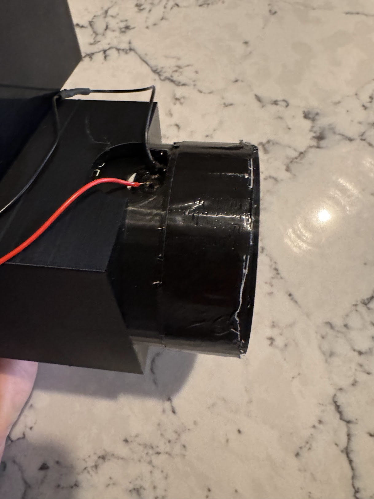

### Powering on
When powering on the unit, please remember to do so in a dark room. These units are sensitive, and turning them on in full sunlight can damage them. Once powered on, you should hear a high-pitched whine and the ocular lens should light up bright green.

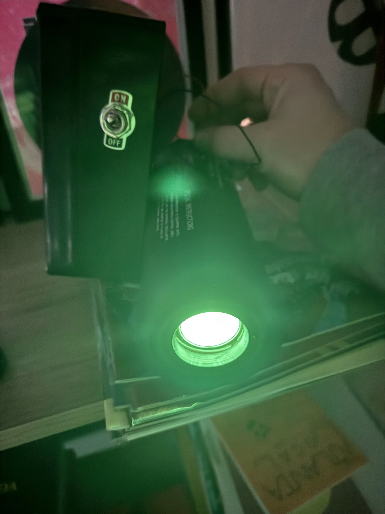

Adjust the objective lens to the desired brightness and focal length to get a clear picture.

From here, if satisfied, both endcaps can be permanently secured with glue or "more permanently" secured with additional layers of duct tape.

### Example images
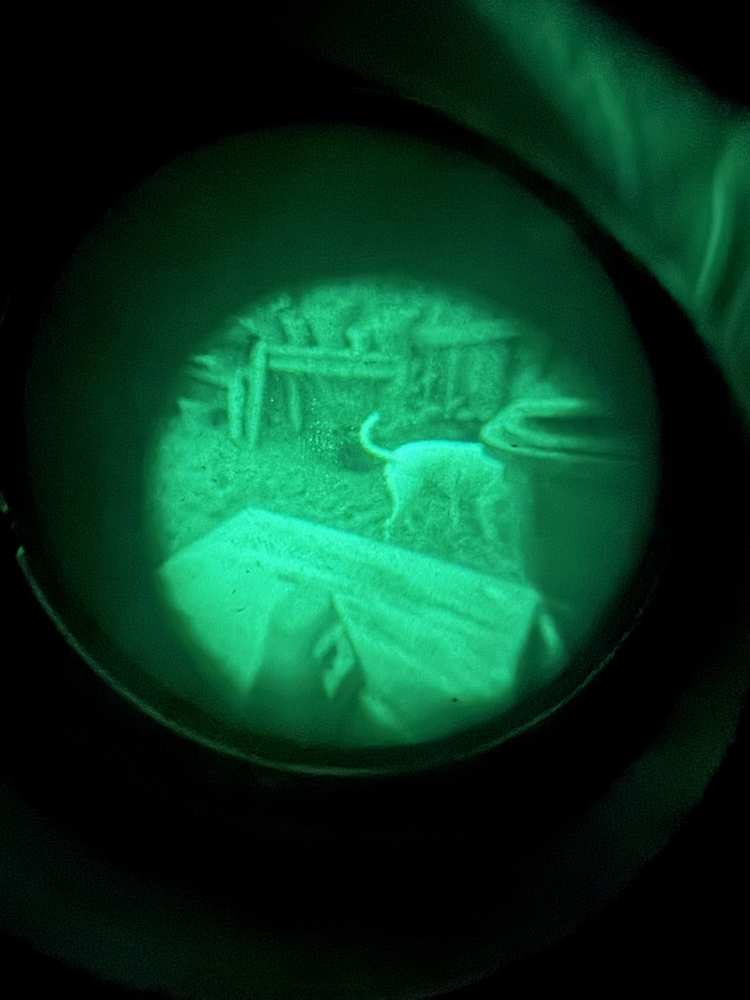
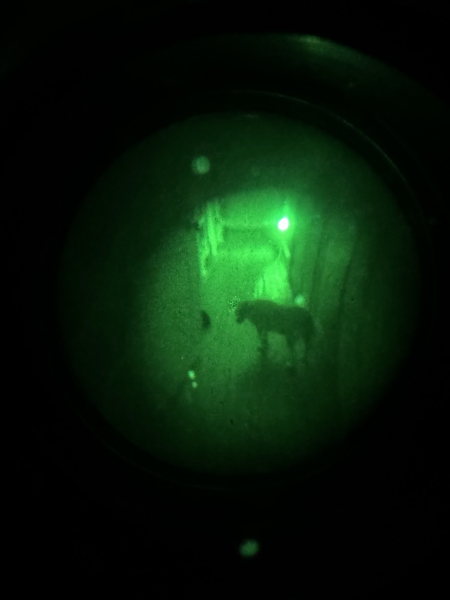
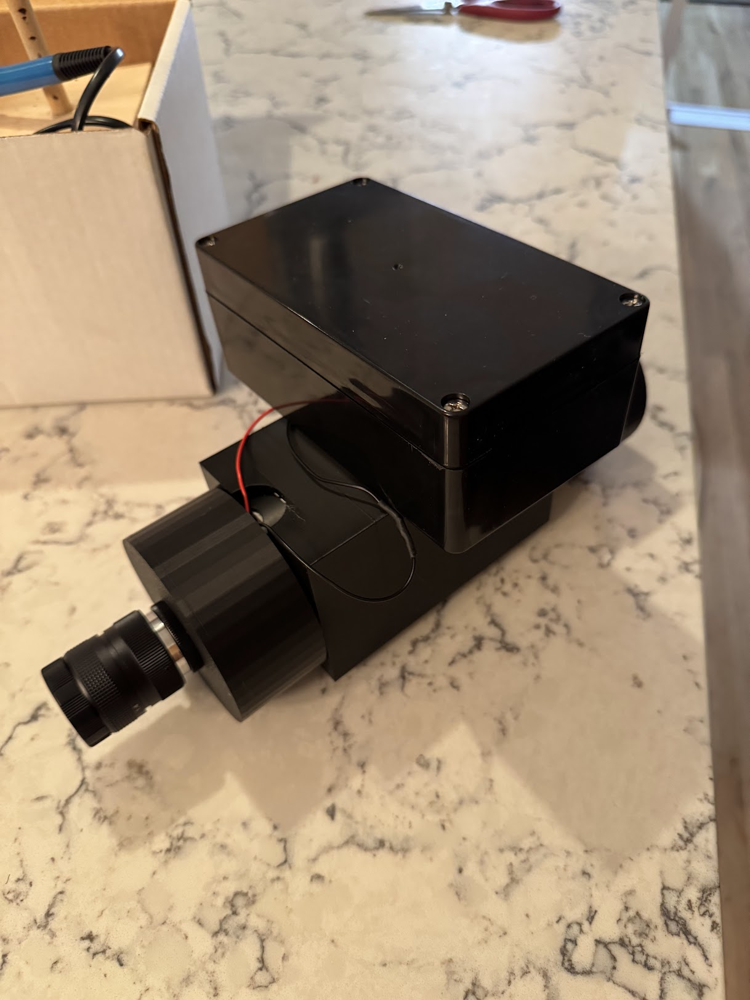

## Other resources
- [Instructables](https://www.instructables.com/DIY-Cascade-Night-Vision-Scope/)
- [AR15.com discussion](https://www.ar15.com/forums/Armory/DIY-Cascade-Tube-Thread-/18-359614/) (many links are outdated)
- [Cloudy Nights dicussion](https://www.cloudynights.com/topic/717215-diy-gen-1-cascade-p7089hp-cruise-ship-nvd/)

## TODO: Improvements
### Better battery housing
The battery housing is a piece of plastic. This should be improved so that it's printable instead of buying one and fastening it to the top of the printed parts.

### Picatinny
Add rails to main body to support things like IR lasers.

### Clamshell body
Move away from unibody design to a clamshell to allow for easier wiring, tube adjustments, disassembly, etc.

